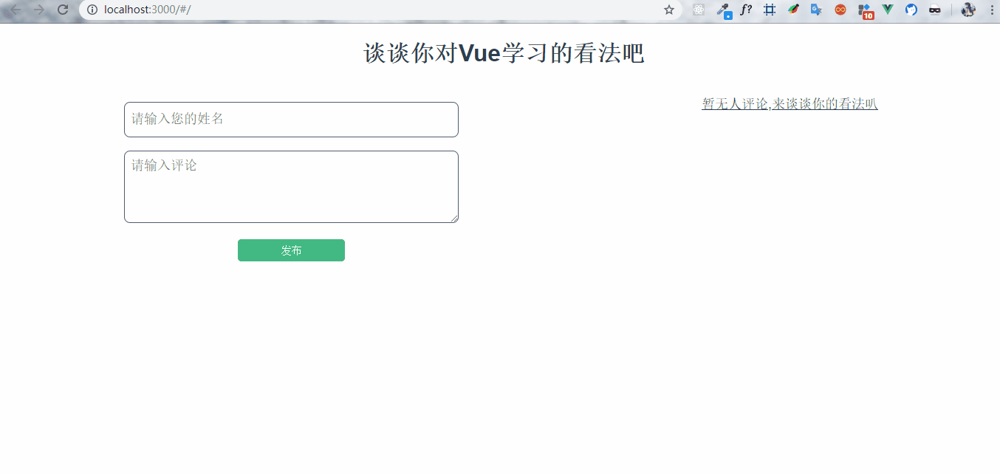

# vue-app

## Introduce

> 简单的练习一下Vue，从最简单的评论开始。为了对比学习React。

## Project setup
```
npm install
```

### Compiles and hot-reloads for development
```
npm run serve
```

### Compiles and minifies for production
```
npm run build
```

### Run your tests
```
npm run test
```

### Lints and fixes files
```
npm run lint
```
## Effect




